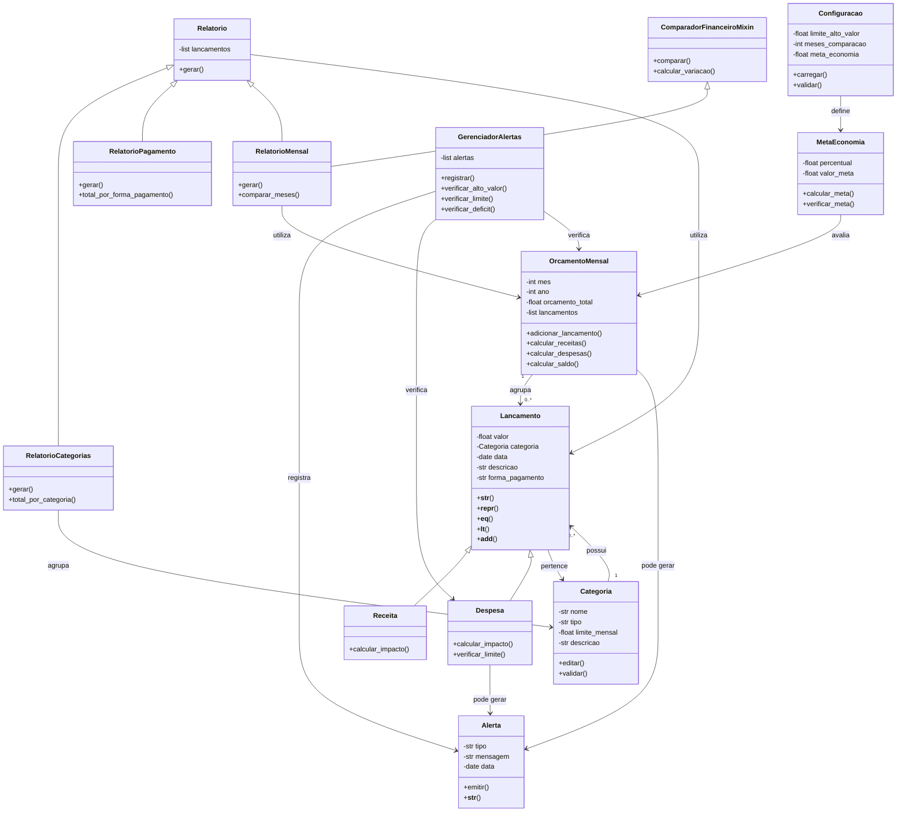

# Projeto-POO-Sistema-de-Controle-de-Despesas-Pessoais

Projeto inicial em Python da disciplina Programação Orientada a Objetos do curso de Engenharia de Software.

O sistema terá como principal função o controle de movimentações com o intuito de gerenciar receitas, despesas e orçamentos pessoais. O sistema contará com relatórios automáticos e alertas de gastos, além de permitir o cadastro de categorias, o controle mensal das finanças e o cálculo de saldo disponível com o armazenamento persistente em JSON.

O foco do projeto é aplicar encapsulamento, herança, métodos especiais, validações rigorosas e relações entre múltiplas classes.

## Objetivo

Desenvolver um sistema de controle financeiro pessoal capaz de registrar receitas e despesas, organizar movimentações por categorias, controlar o orçamento mensal e apresentar informações sobre a situação financeira do usuário.

## Estrutura planejada

O projeto será organizado em diferentes módulos para separar as responsabilidades do sistema.

```text
Projeto-POO-Sistema-de-Controle-de-Despesas-Pessoais/
│
├── src/
│   │
│   ├── entities/
│   │   ├── __init__.py
│   │   │
│   │   ├── transactions/
│   │   │   ├── __init__.py
│   │   │   ├── lancamento.py
│   │   │   ├── receita.py
│   │   │   └── despesa.py
│   │   │
│   │   ├── finance/
│   │   │   ├── __init__.py
│   │   │   ├── categoria.py
│   │   │   ├── orcamento_mensal.py
│   │   │   └── meta_economia.py
│   │   │
│   │   ├── alerts/
│   │   │   ├── __init__.py
│   │   │   ├── alerta.py
│   │   │   └── gerenciador_alertas.py
│   │   │
│   │   ├── reports/
│   │   │   ├── __init__.py
│   │   │   ├── relatorio.py
│   │   │   ├── relatorio_categorias.py
│   │   │   ├── relatorio_pagamento.py
│   │   │   └── relatorio_mensal.py
│   │   │
│   │   └── configuration/
│   │       ├── __init__.py
│   │       └── configuracao.py
│   │
│   ├── services/
│   │   ├── __init__.py
│   │   └── comparador_financeiro.py
│   │
│   ├── persistence/
│   │   ├── __init__.py
│   │   └── json_repository.py
│   │
│   ├── tests/
│   │   ├── __init__.py
│   │   └── ...
│   │
│   └── data/
│       └── ...
│
├── main.py
├── settings.json
├── README.md
└── requirements.txt
```

### Classes planejadas

#### Lançamentos

* **Lancamento** — classe base para representar movimentações financeiras.
* **Receita** — representa entradas financeiras.
* **Despesa** — representa saídas financeiras.

#### Controle financeiro

* **Categoria** — organiza as receitas e despesas por categorias.
* **OrcamentoMensal** — controla o orçamento, os lançamentos e o saldo mensal.
* **MetaEconomia** — representa a meta de economia definida para o período.

#### Alertas

* **Alerta** — representa notificações relacionadas às regras financeiras.
* **GerenciadorAlertas** — gerencia e verifica os alertas gerados pelo sistema.

#### Relatórios

* **Relatorio** — classe base para os relatórios financeiros.
* **RelatorioCategorias** — apresenta as despesas agrupadas por categoria.
* **RelatorioPagamento** — apresenta as despesas agrupadas por forma de pagamento.
* **RelatorioMensal** — apresenta comparações das movimentações financeiras entre meses.

#### Configuração e serviços

* **Configuracao** — representa as configurações utilizadas pelas regras financeiras do sistema.
* **ComparadorFinanceiroMixin** — fornece comportamentos para comparação de dados financeiros e é utilizado pelo `RelatorioMensal`.

O sistema terá uma interface de linha de comando (CLI) para interação com o usuário.


### Diagrama UML


